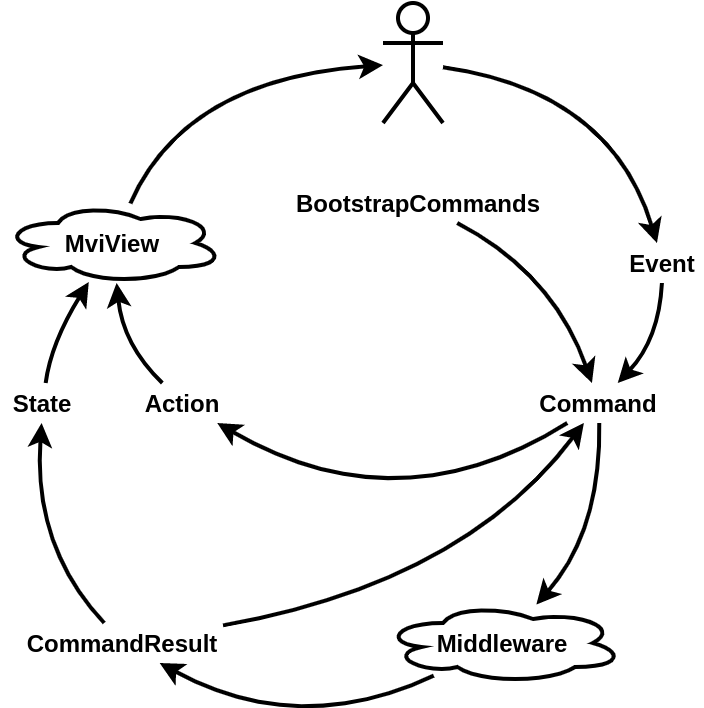

# Jungle
[  ](https://bintray.com/c5fr7q/Jungle/jungle/_latestVersion)
[](http://www.apache.org/licenses/LICENSE-2.0.html)

Jungle is a Kotlin MVI library, that uses [RxJava](https://github.com/ReactiveX/RxJava) and its reactive approach.

Advantages of this lib:
* Easy to understand and use
* Can improve project structure
* Goes well with Clean Architecture

### Inspired by
* Hannes Dorfmann's [Reactive Apps with Model-View-Intent](http://hannesdorfmann.com/android/mosby3-mvi-1) series of articles
* Jake Wharton's [Managing State with RxJava](https://www.youtube.com/watch?v=0IKHxjkgop4)

## Getting started

### Download
Gradle:
```groovy
implementation 'com.github.c5fr7q:jungle:1.1.1'
```
Maven:
```xml
<dependency>
  <groupId>com.github.c5fr7q</groupId>
  <artifactId>jungle</artifactId>
  <version>1.1.1</version>
  <type>pom</type>
</dependency>
```

### Base vokabulary
* **State** - an entity, that contains data about persistent part of UI.
* **Action** - an entity, that contains data about unstable part of UI.
* **Event** - an ***Intent*** of user.

### Base classes
* **Store** - this is where the magic is. Analogue of Presenter from MVP. Middleman between Model and View.
* **Middleware** - a middleman between ***one*** functionality of business logic and UI.
* **MviView** - a View from MVI. An interface, that contains two methods for dealing with ***actions*** and ***states***.

### Under the hood


## Usage examples
1. [Creating first store](https://github.com/C5FR7Q/Jungle/wiki/Creating-first-Store)
2. [Dispatching events](https://github.com/C5FR7Q/Jungle/wiki/Dispatching-events)
3. [Dealing with Middleware](https://github.com/C5FR7Q/Jungle/wiki/Dealing-with-Middleware)
4. [Producing States](https://github.com/C5FR7Q/Jungle/wiki/Producing-States)
5. [Producing Actions](https://github.com/C5FR7Q/Jungle/wiki/Producing-Actions)
6. [What to use, State or Action?](https://github.com/C5FR7Q/Jungle/wiki/What-to-use,-State-or-Action%3F)

## Articles
Will be soon

